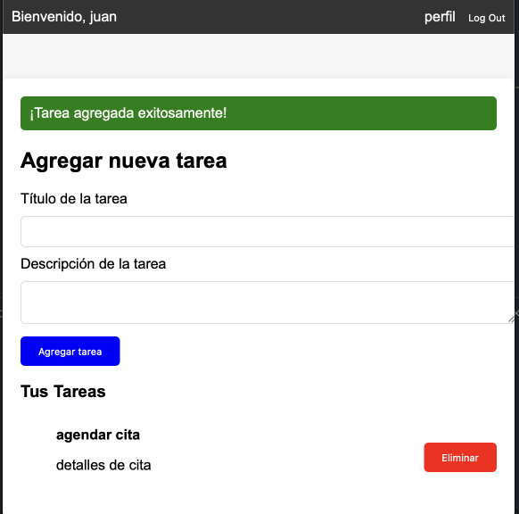

# User Task Manager

This is a simple **to-do list application** built with Laravel, featuring user authentication and CRUD operations. Each user can manage their own tasks, ensuring privacy and control over personal task data. 



## Features

- **User Authentication**: Users can sign up, log in, and manage their own tasks securely.
- **Task Management**: Users can create, view, edit, and delete tasks. Each task is associated with a specific user, ensuring that only the task owner can view or modify it.
- **Database Relations**: Tasks are linked to users using a one-to-many relationship. 
- **Responsive Design**: The UI is fully responsive, providing a clean and accessible user experience across devices.
- **Validation**: Form inputs are validated both on the client and server side to ensure data integrity.

## Installation

To run this project locally, follow these steps:

1. Clone the repository:
    ```
    git clone https://github.com/flpmarin/user_task_manager.git
    ```

2. Navigate to the project directory:
    ```
    cd user_task_manager
    ```

3. Install the dependencies:
    ```
    composer install
    ```

4. Set up the environment file:
    ```
    cp .env.example .env
    php artisan key:generate
    ```

5. Configure your database in the `.env` file (using PostgreSQL).

6. Run the database migrations:
    ```
    php artisan migrate
    ```

7. Serve the application:
    ```
    php artisan serve
    ```

## Technology Stack

- **Backend**: Laravel 11
- **Frontend**: Blade templates 
- **Database**: PostgreSQL
- **Authentication**: Laravel Jetstream 

## Why this Project?

This project is part of my learning journey with Laravel and web development for Data-Access Class

## Future Improvements

- Implementing task deadlines and priority levels.
- Adding support for task categories or labels.
- Introducing notifications or reminders for upcoming tasks.
- Potential API development for mobile app integration.

## Contact

If you have any questions or suggestions, feel free to reach out: marinbecerra.felipe@gmail.com
